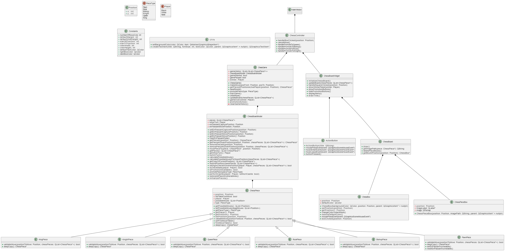
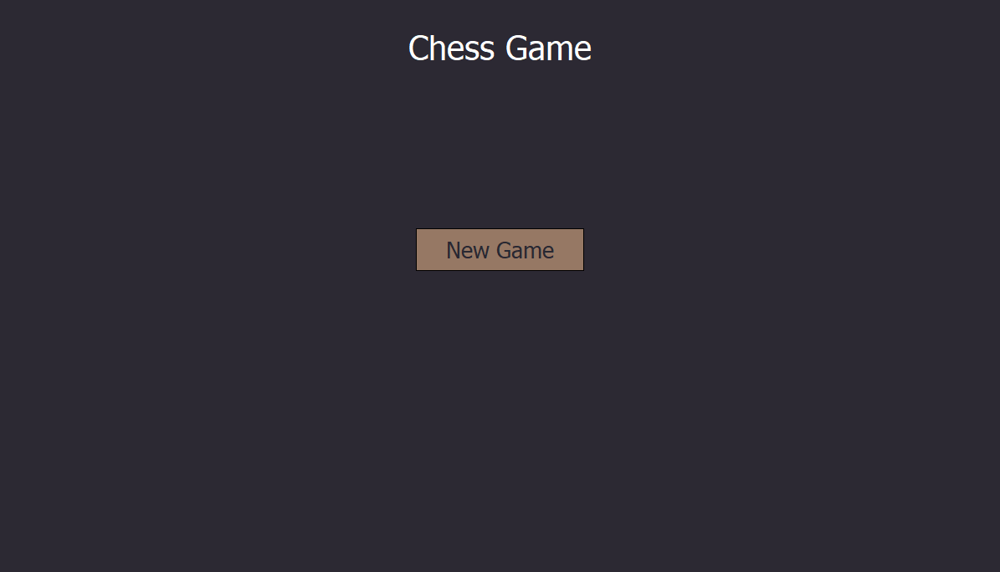
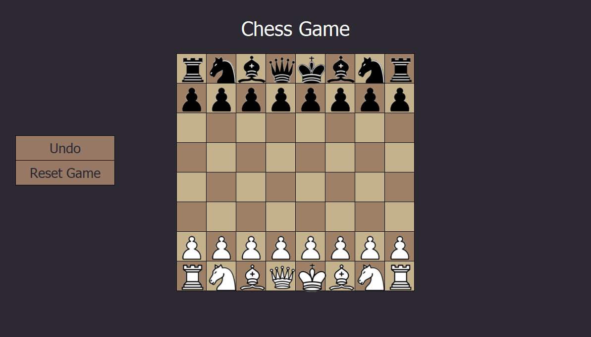
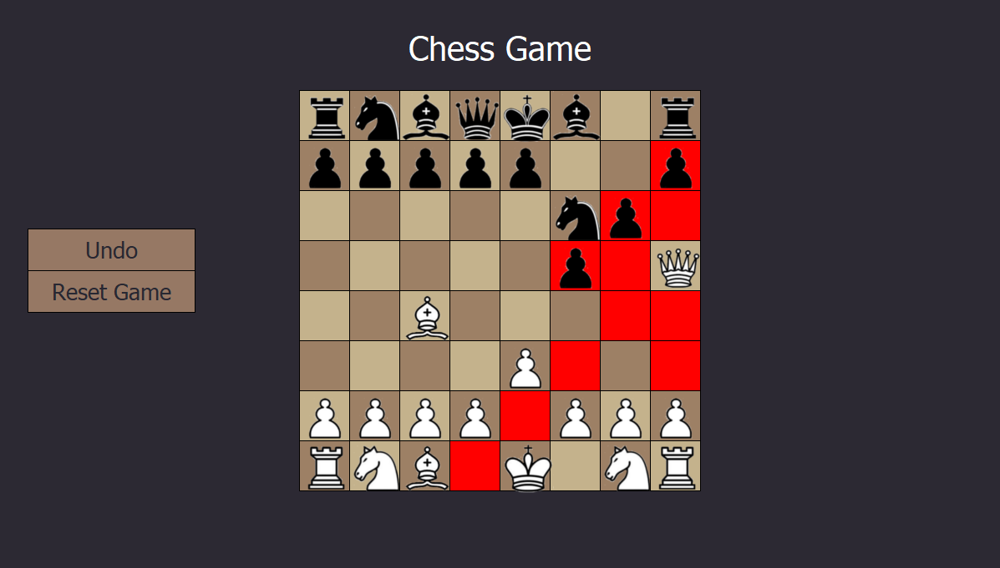

# Chess Game Project Documentation

## Project Overview
This project is a 1vs1 chess game developed in C++ using Qt 6.5.8 (msvc2019_64) for the GUI. It implements core chess logic, including piece movement, game state management, and a move undo feature. The interactive chessboard allows for real-time updates and intuitive piece movement.

---

## Directory Structure

```
.
│   ActionButton.cpp/h         - GUI buttons for actions like undo
│   BishopPiece.cpp/h          - Bishop piece logic
│   ChessBoard.cpp/h           - Main chessboard layout and operations
│   ChessBoardModel.cpp/h      - Data model for the chessboard
│   ChessBoardWidget.cpp/h     - GUI widget displaying the chessboard
│   ChessBox.cpp/h             - Individual chessboard squares
│   ChessController.cpp/h      - Controller for game state and logic
│   ChessGame.cpp/h            - Main game loop and logic
│   ChessPiece.cpp/h           - Base class for all chess pieces
│   ChessPieceBox.cpp/h        - Container for piece display
│   Constants.cpp/h            - Constant values used in the project
│   KingPiece.cpp/h            - King piece logic
│   KnightPiece.cpp/h          - Knight piece logic
│   main.cpp                   - Entry point of the application
│   MainWindow.cpp/h/ui/qrc    - Main application window design and resources
│   PawnPiece.cpp/h            - Pawn piece logic
│   Position.h                 - Helper for board positions
│   QueenPiece.cpp/h           - Queen piece logic
│   RookPiece.cpp/h            - Rook piece logic
│   Utils.cpp/h                - Utility functions
│   docs/                      - Project documentation
│   images/                    - Project images and assets
│   uml/                       - UML diagrams for the project
│   x64/                       - 64-bit build files
│   MVC_ChessGame.vcxproj*     - Visual Studio project files
```

---

## Key Features
- **Piece Movement**: Implements rules for each chess piece.
- **Game State Management**: Tracks the current state, including turns, check, and checkmate.
- **Undo Feature**: Allows players to revert to previous moves.
- **Qt GUI**: Provides an interactive board with real-time updates.

---

## Build Instructions

### Prerequisites
- C++ compiler (MSVC 2019 or later)
- Qt 6.5.8 (msvc2019_64)
- CMake or Visual Studio with CMake support

### Steps
1. Clone the repository.
2. Open the `MVC_ChessGame.vcxproj` in Visual Studio.
3. Ensure the Qt path is set in project settings.
4. Build and run the project.

---

## UML Diagrams
UML diagrams are stored in the `uml/` directory, detailing class relationships and application architecture.


---

## Future Improvements
- Add AI opponent functionality.
- Implement game save/load feature.
- Add network-based multiplayer support.

---

## Acknowledgments
This project was developed to enhance C++ programming, GUI development, and game logic implementation skills.

---

## Documentation Location
The entire project documentation is generated using Doxygen and can be found in the `MVC_ChessGame/docs/doxygen/html/index.html`.


## Start Page


## Chess Board


## Legal Moves Hint

